# selfx402-framework

[](https://www.npmjs.com/package/selfx402-framework)
[](https://opensource.org/licenses/MIT)
[](https://www.npmjs.com/package/selfx402-framework)

> 🚀 **Framework for building x402 facilitator servers and Self Protocol validators**

A production-ready TypeScript framework that reduces x402 facilitator implementation from 600+ lines to 5-10 lines. Combines x402 micropayments with Self Protocol proof-of-unique-human verification.

**Published by [zkNexus](https://www.zknexus.xyz)** - Where proof-of-unique-human meets instant micropayments.

**Inspired by thirdweb SDK architecture** - Modular, type-safe, and developer-friendly.

---

## 🎯 Overview

The `selfx402-framework` provides everything needed to build a complete payment facilitator:

- **x402 Protocol**: HTTP-native crypto micropayments with EIP-712 signatures
- **Self Protocol**: Zero-knowledge passport verification for Sybil resistance
- **Deferred Payments**: Aggregate micro-payments for 99% gas savings (x402 PR #426)
- **TypeScript**: Full type safety with comprehensive type definitions
- **Database Integration**: PostgreSQL/Supabase for nullifier tracking and session management
- **Modular Design**: Use only what you need with tree-shakeable exports

### Key Features

✅ **Complete x402 Implementation** - Payment verification and settlement
✅ **Self Protocol Integration** - Proof-of-unique-human verification
✅ **Deferred Payment Scheme** - 99% gas savings via off-chain aggregation (x402 PR #426)
✅ **Verification Sessions** - Deep link polling for mobile-first flows 🆕
✅ **EIP-712 Signatures** - Phishing-resistant typed data signing
✅ **EIP-3009 Settlement** - Gasless USDC transfers on Celo
✅ **Database Support** - PostgreSQL/Supabase with optional in-memory mode
✅ **TypeScript** - 100% type coverage with comprehensive definitions
✅ **Modular Exports** - Import only what you need

---

## 📦 Installation

```bash
npm install selfx402-framework viem
```

### Peer Dependencies

```bash
npm install express cors  # If using Express middleware
```

---

## 🏗️ Architecture

### System Architecture


### Module Architecture


---

## 🔄 Payment Flow

### Immediate Payment Sequence


### Deferred Payment Sequence


### Self Protocol Verification Flow

```mermaid
sequenceDiagram
    actor User
    participant Widget as Payment Widget
    participant Facilitator as Facilitator Server
    participant Framework as selfx402-framework
    participant Database as PostgreSQL/Supabase
    participant SelfApp as Self Mobile App

    Note over User,SelfApp: Self Protocol Verification

    User->>Widget: Load payment form
    Widget->>Facilitator: Request verification session
    Facilitator->>Framework: verificationSessions.createSession()
    Framework->>Database: INSERT session with sessionId
    Database-->>Framework: Session created
    Framework-->>Facilitator: Session data
    Facilitator-->>Widget: QR code + deep link

    alt QR Code Flow
        User->>SelfApp: Scan QR code
    else Deep Link Flow
        User->>Widget: Click "Copy Link"
        Widget->>Widget: Start polling (2s interval)
        User->>SelfApp: Paste link, open Self app
    end

    SelfApp->>SelfApp: Read passport NFC
    SelfApp->>SelfApp: Generate ZK proof
    SelfApp->>Facilitator: POST /api/verify (proof)
    Facilitator->>Framework: selfVerifier.verify(proof)
    Framework->>Framework: Verify ZK proof
    Framework->>Framework: Extract nullifier
    Framework->>Database: Check nullifier uniqueness
    Database-->>Framework: Nullifier valid
    Framework->>Database: Store nullifier
    Framework->>Database: Update session verified=true
    Framework-->>Facilitator: Verification result

    alt QR Flow
        Facilitator-->>SelfApp: Success callback
        SelfApp-->>Widget: Direct notification
    else Deep Link Flow
        Widget->>Facilitator: Poll GET /verify-status/:sessionId
        Facilitator->>Database: SELECT session WHERE sessionId
        Database-->>Facilitator: Session data
        Facilitator-->>Widget: {verified: true, nullifier}
    end

    Widget->>Widget: Enable payment button
    Widget-->>User: Ready to pay! ✅
```



---

## 🚀 Quick Start

### 1. Basic x402 Facilitator (5 Lines!)

```typescript
import { Facilitator } from "selfx402-framework";
import { networks } from "selfx402-framework/networks";
import { createWalletClient } from "selfx402-framework/wallets";

// Create facilitator
const facilitator = new Facilitator({
  network: networks.celo,
  wallet: createWalletClient({
    privateKey: process.env.CELO_PRIVATE_KEY as `0x${string}`,
    network: networks.celo,
  }),
});

// Verify payment
const verification = await facilitator.verifyPayment(
  paymentEnvelope,
  vendorAddress,
  expectedAmount
);

if (!verification.valid) {
  return res.status(402).json({ error: "Payment verification failed" });
}

// Settle payment on-chain
const settlement = await facilitator.settlePayment(paymentEnvelope);

res.json({
  success: true,
  txHash: settlement.transactionHash,
  data: yourProtectedData,
});
```

### 2. With Self Protocol Integration

```typescript
import { Facilitator } from "selfx402-framework";
import { networks } from "selfx402-framework/networks";
import { createWalletClient } from "selfx402-framework/wallets";
import { SelfVerifier, DatabaseService } from "selfx402-framework/self";

// Initialize database for nullifier tracking
const database = new DatabaseService({
  url: process.env.SUPABASE_URL!,
  key: process.env.SUPABASE_KEY!,
});

// Create Self Protocol verifier
const selfVerifier = new SelfVerifier(
  {
    scope: "my-app",
    minimumAge: 18,
    excludedCountries: ["IRN", "PRK"],
    ofac: true,
  },
  database
);

// Create facilitator with Self integration
const facilitator = new Facilitator({
  network: networks.celo,
  wallet: createWalletClient({
    privateKey: process.env.CELO_PRIVATE_KEY as `0x${string}`,
    network: networks.celo,
  }),
  selfVerifier,
  enableSelfProtocol: true,
});

// Express endpoint
app.post("/api/verify", async (req, res) => {
  const { proof, publicSignals, attestationId } = req.body;

  // Verify Self Protocol proof
  const selfResult = await selfVerifier.verify(
    { proof, publicSignals, attestationId },
    1 // rewardTier: 1 = human, 0 = bot
  );

  if (!selfResult.valid) {
    return res.status(403).json({ error: "Verification failed" });
  }

  res.json({
    success: true,
    nullifier: selfResult.nullifier,
    tier: selfResult.tier,
    discloseOutput: selfResult.discloseOutput,
  });
});
```

### 3. Deferred Payment Implementation

```typescript
import {
  verifyVoucher,
  validateDeferredEnvelope,
  VoucherDatabaseService,
  createVoucherDomain,
  canAggregateVouchers,
  calculateAggregatedAmount,
} from "selfx402-framework";

// Initialize voucher database
const voucherDb = new VoucherDatabaseService({
  url: process.env.SUPABASE_URL!,
  serviceRoleKey: process.env.SUPABASE_SERVICE_ROLE_KEY!,
});

// Verify and store voucher
app.post("/deferred/verify", async (req, res) => {
  const envelope = req.body;

  // Validate envelope
  const validation = validateDeferredEnvelope(envelope);
  if (!validation.valid) {
    return res.status(400).json({ error: validation.errors });
  }

  // Create EIP-712 domain
  const domain = createVoucherDomain(
    42220, // Celo mainnet
    "0xcebA9300f2b948710d2653dD7B07f33A8B32118C" // USDC
  );

  // Verify signature
  const verification = await verifyVoucher(
    envelope.voucher,
    envelope.signature,
    domain
  );

  if (!verification.valid) {
    return res.status(401).json({ error: "Invalid signature" });
  }

  // Store voucher
  const stored = await voucherDb.storeVoucher({
    payer_address: envelope.voucher.payer.toLowerCase(),
    payee_address: envelope.voucher.payee.toLowerCase(),
    amount: envelope.voucher.amount.toString(),
    nonce: envelope.voucher.nonce,
    signature: envelope.signature,
    valid_until: new Date(envelope.voucher.validUntil * 1000).toISOString(),
    settled: false,
    network: envelope.network,
    scheme: "deferred",
  });

  res.json({
    success: true,
    voucher_id: stored.id,
    signer: verification.signer,
    scheme: "deferred",
  });
});

// Aggregate and settle vouchers
app.post("/deferred/settle", async (req, res) => {
  const { payee, network } = req.body;

  // Get unsettled vouchers
  const vouchers = await voucherDb.getUnsettledVouchers(null, payee, network);

  if (vouchers.length === 0) {
    return res.status(404).json({ error: "No unsettled vouchers" });
  }

  // Validate aggregation
  const validation = canAggregateVouchers(vouchers);
  if (!validation.valid) {
    return res.status(400).json({ error: validation.errors });
  }

  // Calculate total
  const totalAmount = calculateAggregatedAmount(vouchers);

  // Settle on-chain
  const settlement = await facilitator.settlePayment(/* envelope */);

  // Mark as settled
  await voucherDb.markVouchersSettled(vouchers.map((v) => v.id!));

  res.json({
    success: true,
    txHash: settlement.transactionHash,
    totalAmount: totalAmount.toString(),
    voucherCount: vouchers.length,
    scheme: "deferred",
  });
});
```

---

## 📋 Complete Usage Examples

### Express Server with All Features

```typescript
import express from "express";
import cors from "cors";
import {
  Facilitator,
  SelfVerifier,
  DatabaseService,
  VerificationSessionsService,
  VoucherDatabaseService,
} from "selfx402-framework";
import { networks } from "selfx402-framework/networks";
import { createWalletClient } from "selfx402-framework/wallets";

const app = express();
app.use(cors());
app.use(express.json());

// Initialize services
const database = new DatabaseService({
  url: process.env.SUPABASE_URL!,
  key: process.env.SUPABASE_KEY!,
});

const selfVerifier = new SelfVerifier(
  {
    scope: "my-app",
    minimumAge: 18,
    excludedCountries: [],
    ofac: false,
  },
  database
);

const verificationSessions = new VerificationSessionsService(
  process.env.SUPABASE_URL!,
  process.env.SUPABASE_SERVICE_ROLE_KEY!
);

const voucherDb = new VoucherDatabaseService({
  url: process.env.SUPABASE_URL!,
  serviceRoleKey: process.env.SUPABASE_SERVICE_ROLE_KEY!,
});

const facilitator = new Facilitator({
  network: networks.celo,
  wallet: createWalletClient({
    privateKey: process.env.CELO_PRIVATE_KEY as `0x${string}`,
    network: networks.celo,
  }),
  selfVerifier,
  enableSelfProtocol: true,
});

// Self Protocol verification
app.post("/api/verify", async (req, res) => {
  try {
    const result = await selfVerifier.verify(req.body, 1);
    res.json({ success: result.valid, ...result });
  } catch (error) {
    res.status(400).json({ error: (error as Error).message });
  }
});

// Verification session polling
app.get("/verify-status/:sessionId", async (req, res) => {
  try {
    const status = await verificationSessions.getVerificationStatus(
      req.params.sessionId
    );
    res.json(status);
  } catch (error) {
    res.status(404).json({ error: "Session not found" });
  }
});

// Immediate payment
app.post("/api/protected", async (req, res) => {
  const paymentHeader = req.headers["x-payment"] as string;

  if (!paymentHeader) {
    return res.status(402).json({ error: "Payment required" });
  }

  const envelope = JSON.parse(paymentHeader);

  // Verify payment
  const verification = await facilitator.verifyPayment(
    envelope,
    process.env.VENDOR_ADDRESS!,
    "1000" // 0.001 USDC
  );

  if (!verification.valid) {
    return res.status(402).json({ error: "Invalid payment" });
  }

  // Settle payment
  const settlement = await facilitator.settlePayment(envelope);

  res.json({
    success: true,
    txHash: settlement.transactionHash,
    data: "Your protected resource",
  });
});

// Deferred payment verification
app.post("/deferred/verify", async (req, res) => {
  // Implementation from example above
});

// Deferred payment settlement
app.post("/deferred/settle", async (req, res) => {
  // Implementation from example above
});

app.listen(3005, () => {
  console.log("Facilitator running on port 3005");
});
```

---

## 🗄️ Database Setup

### Supabase Configuration

1. **Create Supabase Project**: https://supabase.com

2. **Run SQL Schemas**:

```sql
-- Nullifiers table (Self Protocol)
CREATE TABLE nullifiers (
  id UUID DEFAULT gen_random_uuid() PRIMARY KEY,
  nullifier TEXT NOT NULL,
  scope TEXT NOT NULL,
  user_id TEXT,
  nationality TEXT,
  expires_at TIMESTAMP WITH TIME ZONE NOT NULL,
  metadata JSONB DEFAULT '{}'::jsonb,
  created_at TIMESTAMP WITH TIME ZONE DEFAULT NOW(),
  UNIQUE(nullifier, scope)
);

CREATE INDEX idx_nullifiers_scope ON nullifiers(scope);
CREATE INDEX idx_nullifiers_expires ON nullifiers(expires_at);

-- Verification sessions (Deep link polling)
CREATE TABLE verification_sessions (
  id UUID PRIMARY KEY DEFAULT gen_random_uuid(),
  session_id TEXT NOT NULL UNIQUE,
  vendor_url TEXT NOT NULL,
  wallet_address TEXT NOT NULL,
  api_endpoint TEXT,
  network TEXT NOT NULL DEFAULT 'celo',
  disclosures JSONB NOT NULL DEFAULT '{}'::jsonb,
  verified BOOLEAN DEFAULT false,
  nullifier TEXT,
  disclosure_results JSONB DEFAULT '{}'::jsonb,
  created_at TIMESTAMP WITH TIME ZONE DEFAULT NOW(),
  verified_at TIMESTAMP WITH TIME ZONE,
  expires_at TIMESTAMP WITH TIME ZONE NOT NULL,
  proof_data JSONB,
  metadata JSONB DEFAULT '{}'::jsonb
);

CREATE INDEX idx_verification_sessions_session_id ON verification_sessions(session_id);
CREATE INDEX idx_verification_sessions_expires ON verification_sessions(expires_at);

-- Vouchers table (Deferred payments)
CREATE TABLE vouchers (
  id UUID PRIMARY KEY DEFAULT gen_random_uuid(),
  payer_address TEXT NOT NULL,
  payee_address TEXT NOT NULL,
  amount TEXT NOT NULL,
  nonce TEXT NOT NULL UNIQUE,
  signature TEXT NOT NULL,
  valid_until TIMESTAMP NOT NULL,
  settled BOOLEAN NOT NULL DEFAULT false,
  network TEXT NOT NULL,
  scheme TEXT NOT NULL DEFAULT 'deferred',
  created_at TIMESTAMP DEFAULT NOW()
);

CREATE INDEX idx_vouchers_unsettled ON vouchers (payer_address, payee_address, network, settled)
  WHERE settled = false;

-- Settlements table (Deferred payments)
CREATE TABLE settlements (
  id UUID PRIMARY KEY DEFAULT gen_random_uuid(),
  tx_hash TEXT NOT NULL UNIQUE,
  payee_address TEXT NOT NULL,
  payer_address TEXT NOT NULL,
  total_amount TEXT NOT NULL,
  voucher_count INTEGER NOT NULL,
  network TEXT NOT NULL,
  scheme TEXT NOT NULL DEFAULT 'deferred',
  settled_at TIMESTAMP DEFAULT NOW(),
  voucher_ids TEXT[]
);

CREATE INDEX idx_settlements_payee ON settlements (payee_address, network, settled_at DESC);
```

3. **Get Credentials**:
   - Project URL: `https://your-project.supabase.co`
   - Anon Key: Project Settings → API → `anon` key
   - Service Role Key: Project Settings → API → `service_role` key

4. **Environment Variables**:

```bash
SUPABASE_URL=https://your-project.supabase.co
SUPABASE_KEY=your_anon_key_here
SUPABASE_SERVICE_ROLE_KEY=your_service_role_key_here
CELO_PRIVATE_KEY=0x...
VENDOR_ADDRESS=0x...
```

---

## 📚 Module Exports

### `selfx402-framework`

Main entry point with `Facilitator` class.

```typescript
import { Facilitator } from "selfx402-framework";
```

### `selfx402-framework/networks`

Network configurations for Celo mainnet and Sepolia.

```typescript
import { networks, CELO_MAINNET, CELO_SEPOLIA } from "selfx402-framework/networks";
```

### `selfx402-framework/wallets`

Wallet client creation with viem.

```typescript
import { createWalletClient } from "selfx402-framework/wallets";
```

### `selfx402-framework/core`

Core facilitator functionality for advanced use cases.

```typescript
import { verifyPayment, settlePayment } from "selfx402-framework/core";
```

### `selfx402-framework/self`

Self Protocol integration and verification sessions.

```typescript
import {
  SelfVerifier,
  DatabaseService,
  VerificationSessionsService,
} from "selfx402-framework/self";
```

### `selfx402-framework/middleware`

Express/Hono/Fastify middleware adapters.

```typescript
import { createExpressMiddleware } from "selfx402-framework/middleware";
```

---

## 🔧 API Reference

### Facilitator Class

```typescript
class Facilitator {
  constructor(config: FacilitatorConfig)

  verifyPayment(
    envelope: PaymentEnvelope,
    expectedPayTo: string,
    expectedAmount: string
  ): Promise<VerificationResult>

  settlePayment(envelope: PaymentEnvelope): Promise<SettlementResult>
}

interface FacilitatorConfig {
  network: NetworkConfig
  wallet: WalletClient
  selfVerifier?: SelfVerifier
  enableSelfProtocol?: boolean
}
```

### SelfVerifier Class

```typescript
class SelfVerifier {
  constructor(config: SelfConfig, database?: DatabaseService)

  verify(
    proofHeader: ProofHeader,
    rewardTier: number
  ): Promise<VerificationResult>
}

interface SelfConfig {
  scope: string
  minimumAge: number
  excludedCountries: string[]
  ofac: boolean
}
```

### Deferred Payment Functions

```typescript
function verifyVoucher(
  voucher: PaymentVoucher,
  signature: `0x${string}`,
  domain: TypedDataDomain
): Promise<VoucherVerificationResult>

function canAggregateVouchers(vouchers: Voucher[]): ValidationResult

function calculateAggregatedAmount(vouchers: Voucher[]): bigint

function createVoucherDomain(
  chainId: number,
  usdcAddress: string
): TypedDataDomain
```

---

## 🌐 Network Support

All networks support EIP-3009 USDC for gasless transfers.

### Ethereum Mainnet (Chain ID: 1) ✅

- **RPC**: `https://eth.llamarpc.com`
- **USDC Contract**: `0xA0b86991c6218b36c1d19D4a2e9Eb0cE3606eB48`
- **Explorer**: https://etherscan.io
- **EIP-3009**: ✅ Native Circle USDC

### Base Mainnet (Chain ID: 8453) ✅

- **RPC**: `https://mainnet.base.org`
- **USDC Contract**: `0x833589fCD6eDb6E08f4c7C32D4f71b54bdA02913`
- **Explorer**: https://basescan.org
- **EIP-3009**: ✅ Native Circle USDC

### Arbitrum One (Chain ID: 42161) ✅

- **RPC**: `https://arb1.arbitrum.io/rpc`
- **USDC Contract**: `0xaf88d065e77c8cC2239327C5EDb3A432268e5831`
- **Explorer**: https://arbiscan.io
- **EIP-3009**: ✅ Native Circle USDC

### Celo Mainnet (Chain ID: 42220) ✅

- **RPC**: `https://forno.celo.org`
- **USDC Contract**: `0xcebA9300f2b948710d2653dD7B07f33A8B32118C`
- **Explorer**: https://celoscan.io
- **Self Protocol**: `0xe57F4773bd9c9d8b6Cd70431117d353298B9f5BF`
- **EIP-3009**: ✅ Confirmed and tested

### Avalanche C-Chain (Chain ID: 43114) ✅

- **RPC**: `https://api.avax.network/ext/bc/C/rpc`
- **USDC Contract**: `0xB97EF9Ef8734C71904D8002F8b6Bc66Dd9c48a6E`
- **Explorer**: https://snowtrace.io
- **EIP-3009**: ✅ Native Circle USDC

### Celo Sepolia (Chain ID: 11142220) ✅

- **RPC**: `https://celo-sepolia.g.alchemy.com/v2/demo`
- **USDC Contract**: `0x01C5C0122039549AD1493B8220cABEdD739BC44E`
- **Explorer**: https://celo-sepolia.blockscout.com
- **EIP-3009**: ✅ Testnet

**Why these networks?**
- ✅ All have native Circle USDC with EIP-3009 support
- ✅ Gasless transfers (payer signs, facilitator executes)
- ✅ Low transaction fees
- ✅ Fast block times
- ✅ Production-ready infrastructure

---

## 📖 Documentation

### Official Resources

**Self Protocol**:
- [Quickstart Guide](https://docs.self.xyz/use-self/quickstart)
- [Backend Integration](https://docs.self.xyz/backend-integration)
- [Deployed Contracts](https://docs.self.xyz/contract-integration/deployed-contracts)

**x402 Protocol**:
- [Protocol Overview](https://x402.gitbook.io/x402)
- [HTTP 402 Concept](https://x402.gitbook.io/x402/core-concepts/http-402)
- [Facilitator Guide](https://x402.gitbook.io/x402/core-concepts/facilitator)
- [PR #426 - Deferred Payments](https://github.com/coinbase/x402/pull/426)

**Celo Network**:
- [Protocol Docs](https://docs.celo.org/protocol)
- [USDC on Celo](https://docs.celo.org/protocol/tokens/stable-coins)

### Technical Standards

- **EIP-712**: https://eips.ethereum.org/EIPS/eip-712 (Typed Data Signing)
- **EIP-3009**: https://eips.ethereum.org/EIPS/eip-3009 (Gasless Transfers)

---

## 🚀 Related Projects

### NPM Packages

- **[selfx402-framework](https://www.npmjs.com/package/selfx402-framework)** - This package
- **[selfx402-pay-widget](https://www.npmjs.com/package/selfx402-pay-widget)** - React payment widget

### GitHub Repositories

- **[Selfx402Framework](https://github.com/CodaLabs-xyz/Selfx402Framework)** - This framework
- **[Selfx402Pay](https://github.com/CodaLabs-xyz/Selfx402Pay)** - Consumer demo app
- **[Selfx402PayWidget](https://github.com/CodaLabs-xyz/Selfx402PayWidget)** - Payment widget
- **[Self-x402](https://github.com/JulioMCruz/Self-x402)** - Complete monorepo

---

## 🛠️ Development

### Build Commands

```bash
# Install dependencies
npm install

# Build library
npm run build

# Watch mode
npm run dev

# Type check
npm run type-check

# Clean build artifacts
npm run clean
```

### Project Structure

```
selfx402-framework/
├── src/
│   ├── core/           # Payment verification and settlement
│   ├── networks/       # Network configurations
│   ├── wallets/        # Wallet client creation
│   ├── self/           # Self Protocol integration
│   ├── deferred/       # Deferred payment scheme
│   ├── middleware/     # Framework middleware
│   └── index.ts        # Main exports
├── dist/               # Compiled output
├── package.json
└── tsconfig.json
```

### Publishing to NPM

```bash
# Bump version
npm version patch|minor|major

# Build and publish
npm publish
```

**Current Version**: 1.1.0

---

## 🤝 Contributing

Contributions welcome! Please follow these guidelines:

1. Fork the repository
2. Create feature branch (`git checkout -b feature/amazing-feature`)
3. Commit changes (`git commit -m 'Add amazing feature'`)
4. Push to branch (`git push origin feature/amazing-feature`)
5. Open Pull Request

**Code Style**:
- TypeScript with strict mode
- ESLint configuration
- Conventional commit messages

---

## 📄 License

MIT License

Copyright (c) 2025 zkNexus

Permission is hereby granted, free of charge, to any person obtaining a copy
of this software and associated documentation files (the "Software"), to deal
in the Software without restriction, including without limitation the rights
to use, copy, modify, merge, publish, distribute, sublicense, and/or sell
copies of the Software, and to permit persons to whom the Software is
furnished to do so, subject to the following conditions:

The above copyright notice and this permission notice shall be included in all
copies or substantial portions of the Software.

THE SOFTWARE IS PROVIDED "AS IS", WITHOUT WARRANTY OF ANY KIND, EXPRESS OR
IMPLIED, INCLUDING BUT NOT LIMITED TO THE WARRANTIES OF MERCHANTABILITY,
FITNESS FOR A PARTICULAR PURPOSE AND NONINFRINGEMENT. IN NO EVENT SHALL THE
AUTHORS OR COPYRIGHT HOLDERS BE LIABLE FOR ANY CLAIM, DAMAGES OR OTHER
LIABILITY, WHETHER IN AN ACTION OF CONTRACT, TORT OR OTHERWISE, ARISING FROM,
OUT OF OR IN CONNECTION WITH THE SOFTWARE OR THE USE OR OTHER DEALINGS IN THE
SOFTWARE.

---

## 🙋 Support

**Issues**: https://github.com/CodaLabs-xyz/Selfx402Framework/issues

**Contact**:
- 📧 Email: contact@zknexus.xyz
- 🌐 Website: https://www.zknexus.xyz
- 🐦 Twitter: [@zkNexus](https://twitter.com/zkNexus)

**Documentation**:
- 📚 Self Protocol: https://docs.self.xyz
- 📚 x402 Protocol: https://x402.gitbook.io

---

## 🏆 Credits

Built with ❤️ by [zkNexus](https://www.zknexus.xyz)

**Author**: Julio M Cruz ([@JulioMCruz](https://github.com/JulioMCruz))

**Powered by**:
- [Self Protocol](https://www.self.xyz) - Zero-knowledge identity verification
- [x402 Protocol](https://x402.org) - HTTP-native crypto payments
- [Celo Network](https://celo.org) - Mobile-first blockchain
- [Viem](https://viem.sh) - TypeScript Ethereum library
- [Supabase](https://supabase.com) - Open source Firebase alternative

---

**⚡ Built during Self ZK Residency (Oct 14-31, 2025)**

> "Verify once, pay instantly, access everything" - zkNexus

---

## 📊 Package Stats

- **Bundle Size**: ~150KB (minified)
- **TypeScript**: 100% type coverage
- **Tree-shakeable**: ESM format with modular exports
- **Dependencies**: 5 direct dependencies
- **Node Version**: >=20.0.0
- **License**: MIT
